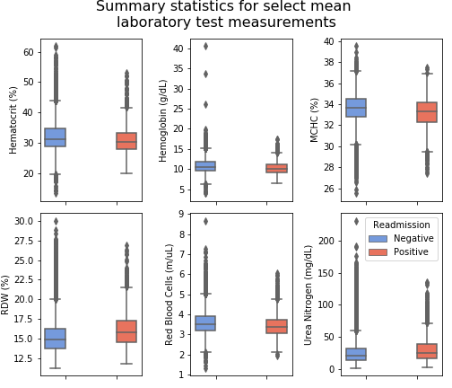
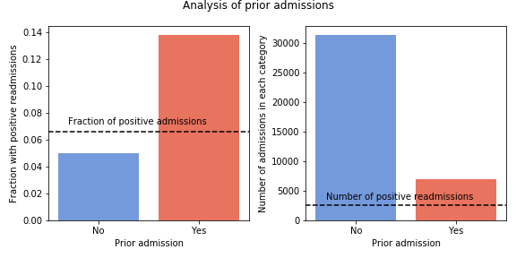
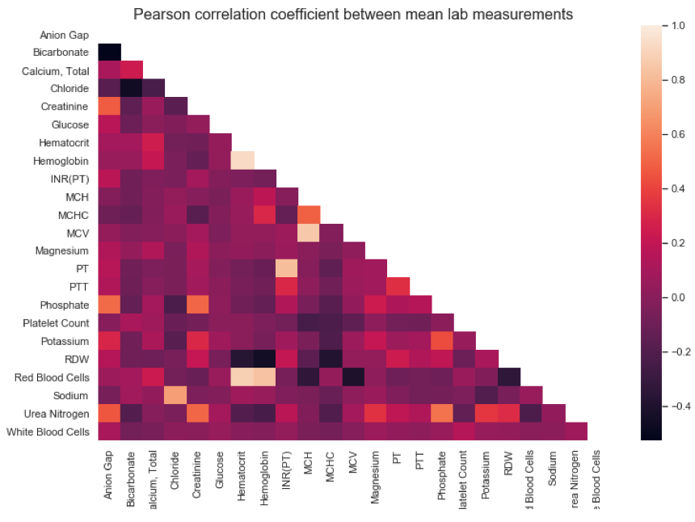
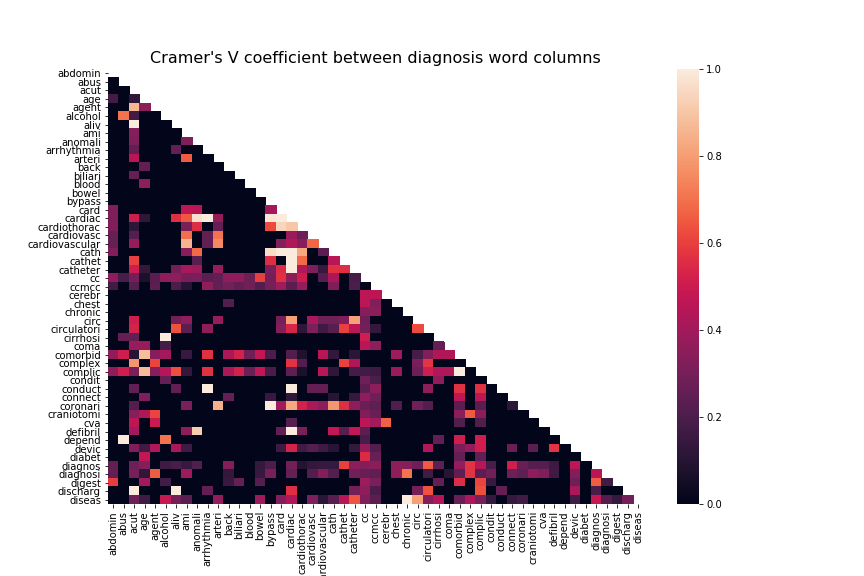
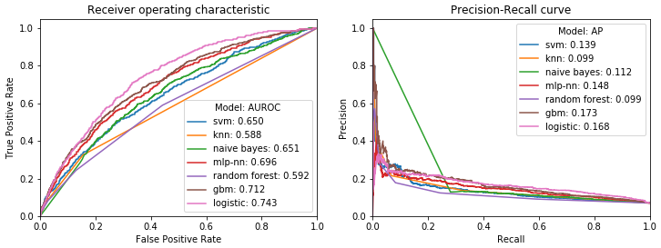
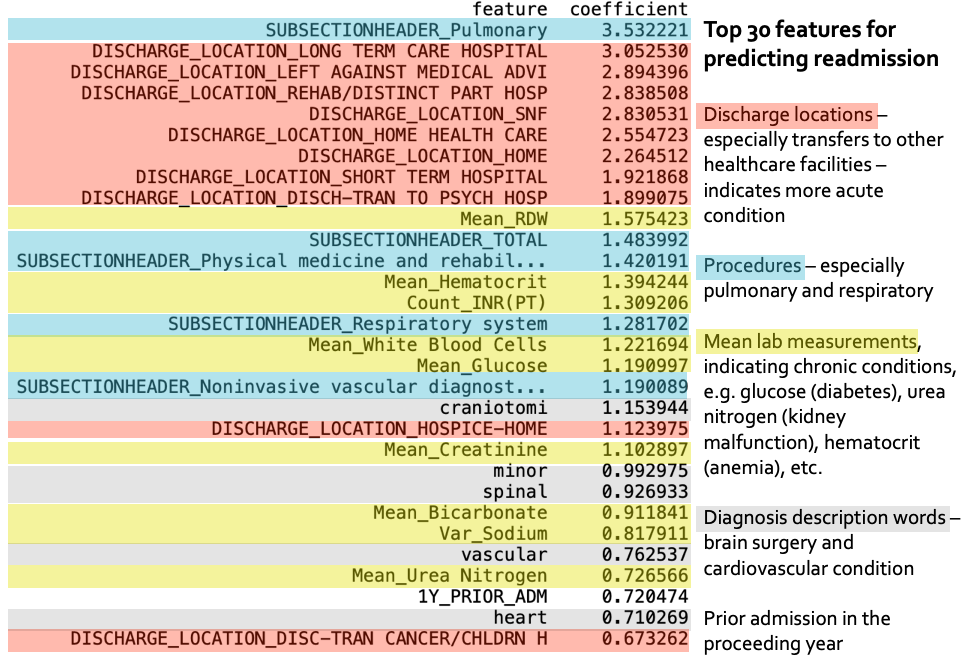
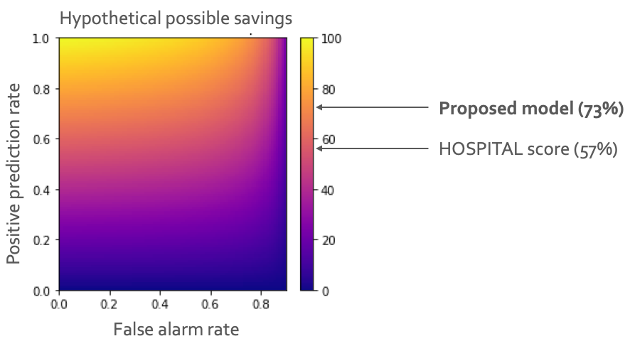

**Predicting 30-day hospital readmissions (MIMIC-III dataset)**

[See full report here](reports/Predicting_readmission_presentation.pptx)

**Goal:** identify patients at high risk of 30-day hospital readmission.

**Background:** Unplanned hospital readmissions result in high costs in
unpaid insurance claims and are generally associated with poor patient
experience and outcome. Hospitals enroll patients at high risk of
readmission into special Care Management programs. Currently, many
hospitals use the HOSPITAL score, to flag high-risk patients. Hospital
score is based on 7 patient characteristics, and is not perfect.

**Approach:** Achieve better predictive performance with machine
learning on a larger set of predictive variables.

**Challenges:** variety of structured and unstructured data, many
processing steps, class imbalance (positive class \~7%).

**Selected features:** Patient demographics, hospital stay details, ICU
services, procedure types, laboratory test measurements, diagnosis
description.

[Data wrangling Jupyter notebooks](exploration/data_cleaning)

**Exploratory data analysis**

Patients in positive and negative readmission groups have different mean
laboratory test measurements (p value \< E-20, t-test for mean
difference of 2 independent samples with unequal variance).

Patients in positive readmission group are likely to have a prior
admission within a year (Chi square statistic 657, p value E-145).

[EDA Jupyter notebook](exploration/visualization)

**Feature selection (314 features -> 188 features)**

Compute Pearson correlation coefficient between numerical variables and
eliminate redundant features with correlation coefficient \>= 0.9. A
plot with laboratory test measurement correlations is presented below.

Compute Cramer's V (strength of association) for categorical variables
and eliminate redundant features with coefficient \>= 0.9. A plot with
diagnosis word associations is presented below.

[Feature selection Jupyter notebook](exploration/feature_selection)

**Machine learning**

Evaluated performance of select machine learning models on the dataset
with reduced features.

Logistic regression is the simplest model with largest area under
receiver operating characteristic curve (AUROC). Although the average
precision (AP) for logistic regression is lower than AP of gradient
boosted machines, it is an acceptable tradeoff for simplicity and high
AUROC.

*Logistic regression classification report*

|                | precision | recall | f1-score | support |
|----------------|-----------|--------|----------|---------|
| Not readmitted | 0.97      | 0.68   | 0.8      | 7109    |
| Readmitted     | 0.14      | 0.69   | 0.23     | 534     |
|                |           |        |          |         |
| accuracy       |           |        | 0.68     | 7643    |
| macro avg      | 0.55      | 0.69   | 0.51     | 7643    |
| weighted avg   | 0.91      | 0.68   | 0.76     | 7643    |

*Logistic regression confusion matrix*

[Machine learning Jupyter notebooks](models)

**Coefficient interpretation**

**Hospital savings analysis**

To evaluate the predictive model's performance in terms of hospital
savings I calculated hospital savings for all possible combinations of
true positive and false positive prediction rates (heatmap below). Next,
I mapped the savings resulting in from the use of the HOSPITAL score and
the proposed logistic regression model.

**The proposed logistic regression model will save the hospital an
additional 16%, on top of the HOSPITAL score, hence it is worth
adopting!**

[Hospital savings model Jupyter notebook](models/Modeling hospital savings.ipynb)
